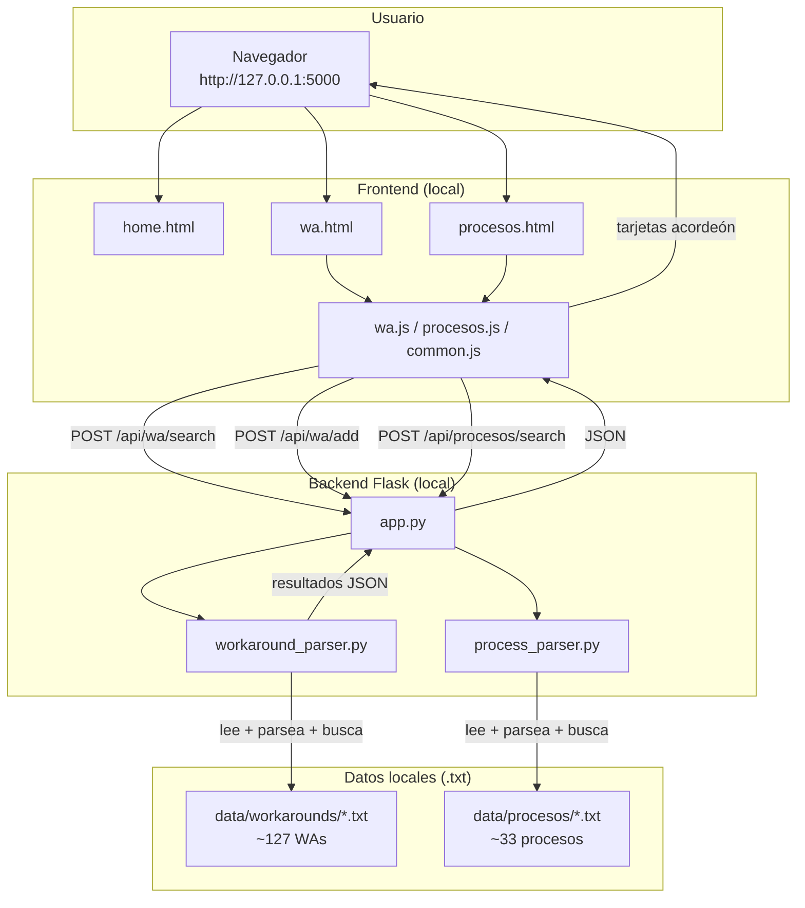
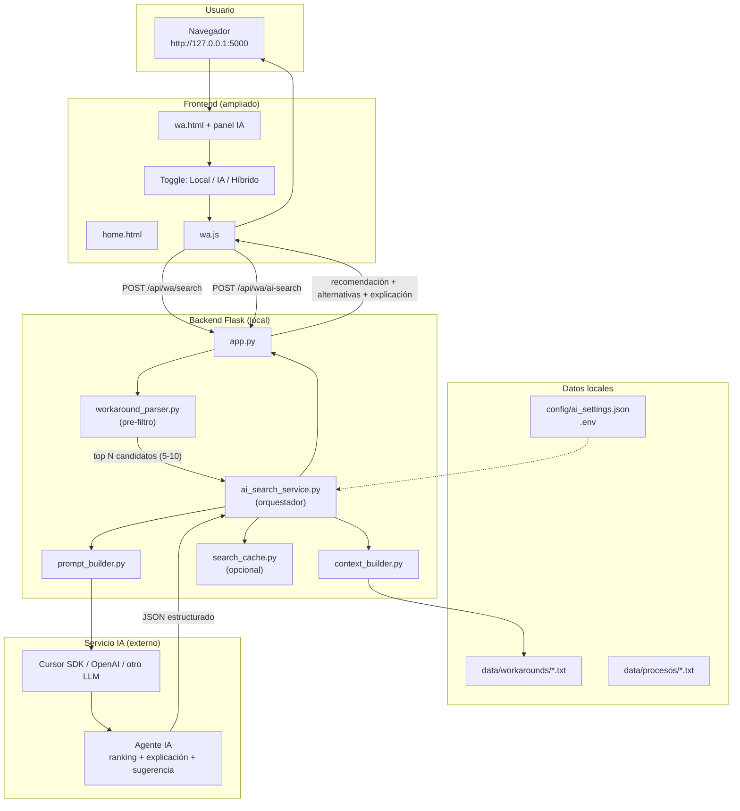

# CSM-WA — Plan de arquitectura híbrida con IA

Documento de planificación para evolucionar la aplicación actual (búsqueda local por texto) hacia un modelo **híbrido**: parser local + IA para ranking, explicación y sugerencias.

**Versión:** 1.0  
**Fecha:** Julio 2026  
**Estado:** Planificación (sin implementar)

---

## Tabla de contenidos

1. [Resumen ejecutivo](#resumen-ejecutivo)
2. [Arquitectura actual](#arquitectura-actual)
3. [Arquitectura nueva (objetivo)](#arquitectura-nueva-objetivo)
4. [Comparación](#comparación)
5. [Plan de implementación por fases](#plan-de-implementación-por-fases)
6. [Contrato API propuesto](#contrato-api-propuesto)
7. [Estructura de archivos nueva](#estructura-de-archivos-nueva)
8. [Estimación de esfuerzo](#estimación-de-esfuerzo)
9. [Riesgos y mitigaciones](#riesgos-y-mitigaciones)
10. [Recomendación final](#recomendación-final)

---

## Resumen ejecutivo

CSM-WA hoy busca workarounds en archivos `.txt` locales usando reglas de coincidencia de texto (`workaround_parser.py`). Funciona bien para coincidencias exactas o parciales, pero no explica por qué un WA es el mejor match, no combina información de varios WAs y no sugiere soluciones nuevas.

La arquitectura propuesta **no reemplaza** el parser local. Lo usa como **capa 1** (pre-filtro rápido) y añade una **capa 2** con IA que analiza los mejores candidatos, elige el más relevante, explica el motivo y opcionalmente sugiere mejoras.

```
Capa 1 (local, rápida, sin costo)  →  encuentra candidatos
Capa 2 (IA, inteligente, con costo) →  elige, explica y sugiere
```

---

## Arquitectura actual

### Diagrama



### Flujo actual

1. El usuario escribe un error o pega un Tuxedo completo en el buscador.
2. `wa.js` envía la consulta a `POST /api/wa/search`.
3. Flask carga todos los archivos `.txt` de `data/workarounds/`.
4. `workaround_parser.py` parsea las entradas y aplica reglas de coincidencia (palabras clave o señales Tuxedo).
5. Devuelve una lista ordenada por score.
6. El frontend muestra resultados en tarjetas acordeón; el usuario expande y revisa manualmente.

### Componentes actuales

| Componente | Rol |
|------------|-----|
| `app.py` | Servidor Flask, rutas web y API REST |
| `workaround_parser.py` | Parser, búsqueda y formato de WAs |
| `process_parser.py` | Parser, búsqueda y formato de procesos |
| `templates/` | Interfaz HTML (home, WAs, procesos) |
| `static/js/` | Búsqueda, formularios, acordeones |
| `data/workarounds/` | Archivos `.txt` con workarounds |
| `data/procesos/` | Archivos `.txt` con procedimientos |

### Limitaciones actuales

- No explica **por qué** un WA es el mejor match.
- No combina información de varios WAs.
- No sugiere soluciones nuevas si ningún WA encaja del todo.
- Búsqueda basada en reglas, no en razonamiento semántico profundo.
- Con errores Tuxedo muy largos y variables, la coincidencia depende de señales extraídas (mejorado recientemente, pero sigue siendo reglas).

---

## Arquitectura nueva (objetivo)

### Diagrama



### Flujo nuevo

1. El usuario pega un error o Tuxedo en el buscador.
2. **Fase 1 (local):** `workaround_parser.py` hace un pre-filtro rápido y devuelve los top 5–10 candidatos.
3. **Fase 2 (IA):** se construye un prompt con la consulta + candidatos (no los 127 WAs completos).
4. La IA analiza y devuelve:
   - WA recomendado (o ninguno si no hay match razonable)
   - Por qué encaja
   - Alternativas ordenadas
   - Sugerencia mejorada (si ningún WA encaja perfectamente)
5. El frontend muestra la recomendación IA destacada + resultados clásicos como respaldo.

### Propuesta de UI

```
[ Search box ]
[ Mode: ● Hybrid  ○ Local only ]

┌─ AI Recommendation ─────────────────────┐
│ Best match: RESUME                      │
│ Confidence: High                        │
│ Why: Matches csRsCanSub, SERVICE_...    │
│ [View full WA]                          │
└─────────────────────────────────────────┘

Other possible matches (local search)
  ▼ RESUME SUBSCRIBER
  ▼ CANCELATION
```

---

## Comparación

| Aspecto | Arquitectura actual | Arquitectura híbrida |
|---------|---------------------|----------------------|
| Motor de búsqueda | Solo `workaround_parser.py` | Parser + IA |
| Velocidad | Milisegundos | Segundos (con IA) |
| Costo por búsqueda | $0 | Tokens / API |
| Conexión a internet | No requerida | Requerida para modo IA |
| Explicación del match | No | Sí ("Why this match") |
| Sugerencia nueva | No | Sí (si no hay match perfecto) |
| Privacidad | Totalmente local | Datos enviados a servicio externo |
| Fallback | N/A | Automático al parser local |
| Datos sensibles (BAN/CTN) | No salen del equipo | Requieren enmascaramiento |

---

## Plan de implementación por fases

### Fase 0 — Definición y decisiones (1–2 días)

| Tarea | Detalle |
|-------|---------|
| Elegir proveedor IA | Cursor SDK, OpenAI, Azure OpenAI, etc. |
| Definir modo de operación | Solo híbrido, o toggle Local / IA / Híbrido |
| Política de datos | Qué campos se envían a la IA (enmascarar BAN/CTN) |
| Presupuesto | Límite de consultas/día, costo estimado por búsqueda |
| Formato de respuesta IA | JSON fijo con campos obligatorios |

**Entregable:** documento de decisiones + contrato JSON de respuesta IA.

---

### Fase 1 — Capa de servicio IA (backend, sin UI)

| Tarea | Archivo(s) |
|-------|------------|
| Configuración | `.env`, `config/ai_settings.json` |
| Orquestador | `ai_search_service.py` |
| Constructor de contexto | `context_builder.py` |
| Constructor de prompt | `prompt_builder.py` |
| Nueva ruta API | `POST /api/wa/ai-search` en `app.py` |
| Validación respuesta | `ai_response_parser.py` |
| Logging | Registrar consultas sin datos sensibles |

**Comportamiento obligatorio:**

- Si la IA no responde → devolver resultados del parser local.
- Si la IA responde mal → fallback local.
- La IA **nunca** debe inventar WAs que no existan en los archivos.

---

### Fase 2 — Mejora del pre-filtro local

| Tarea | Detalle |
|-------|---------|
| Mantener `workaround_parser.py` | Base del modelo híbrido |
| Afinar scoring Tuxedo | Umbrales y señales |
| Endpoint unificado | `/api/wa/search?mode=hybrid` |
| Limitar candidatos | `top_n=8` configurable |
| Metadata por candidato | Error, tags, extracto Tuxedo, workaround truncado |

**Objetivo:** enviar a la IA solo contexto relevante (~8–15 KB), no archivos completos.

---

### Fase 3 — Cambios en frontend

| Tarea | Detalle |
|-------|---------|
| Toggle de modo | Local / Híbrido |
| Panel de recomendación IA | Tarjeta destacada arriba de resultados |
| Sección "Why this match" | Explicación generada por IA |
| Sección "Suggested improvement" | Solo si no hay match perfecto |
| Indicador de carga | "Analyzing with AI…" |
| Fallback visual | Si IA falla, mostrar resultados locales sin error visible |

---

### Fase 4 — Seguridad y privacidad

| Tarea | Detalle |
|-------|---------|
| Enmascaramiento | BAN/CTN → `***` antes de enviar a IA |
| Opt-in / aviso | "This query will be sent to an AI service" |
| `.env` | API keys fuera del repositorio |
| Rate limiting | Máximo N búsquedas IA por minuto |
| Auditoría | Log de consultas sin datos sensibles |

---

### Fase 5 — Extensión a Procesos (opcional)

1. `process_parser.py` → pre-filtro local.
2. Variante de `ai_search_service.py` para procesos.
3. `POST /api/procesos/ai-search`.

---

### Fase 6 — Optimizaciones futuras (v2)

| Mejora | Descripción |
|--------|-------------|
| Embeddings | Indexar WAs vectorialmente para mejor pre-filtro |
| Cache | Misma query + mismos WAs → respuesta cacheada |
| Feedback | Botón "Was this helpful?" para afinar prompts |
| Agregar desde IA | "Save this suggestion as new WA" |
| Batch import | IA ayuda a normalizar WAs nuevos desde Clarify |

---

## Contrato API propuesto

### Request: `POST /api/wa/ai-search`

```json
{
  "query": "1) Failed to retrieve array from SERVICE_AGREEMENT...",
  "mode": "hybrid",
  "top_n": 8
}
```

### Response

```json
{
  "mode": "hybrid",
  "local_results": [],
  "ai": {
    "available": true,
    "recommended": {
      "error": "RESUME",
      "source_file": "csm_workarounds.txt",
      "line_number": 3589,
      "confidence": "high",
      "reason": "Matches csRsCanSub, SERVICE_AGREEMENT cancel RC, SQL-02112..."
    },
    "alternatives": [
      {
        "error": "RESUME SUBSCRIBER",
        "confidence": "medium",
        "reason": "Related resume flow with similar SERVICE_AGREEMENT errors"
      }
    ],
    "suggested_solution": null,
    "disclaimer": "AI-assisted recommendation. Verify before applying in production."
  },
  "fallback_used": false
}
```

### Campos de respuesta IA

| Campo | Tipo | Descripción |
|-------|------|-------------|
| `recommended` | object \| null | WA más relevante según IA |
| `confidence` | high \| medium \| low | Nivel de confianza |
| `reason` | string | Explicación del match |
| `alternatives` | array | Otros WAs posibles |
| `suggested_solution` | string \| null | Solución nueva si no hay match perfecto |
| `fallback_used` | boolean | Si se usó parser local por fallo de IA |

---

## Estructura de archivos nueva

```
csm-wa/
├── app.py                      # rutas + orquestación
├── workaround_parser.py        # pre-filtro (se mantiene)
├── workaround_parser.py.bkp    # backup
├── process_parser.py
├── ai_search_service.py        # NUEVO — llamada a IA
├── context_builder.py          # NUEVO — arma contexto para IA
├── prompt_builder.py           # NUEVO — plantillas de prompt
├── ai_response_parser.py       # NUEVO — valida JSON de IA
├── search_cache.py             # NUEVO — cache opcional
├── config/
│   └── ai_settings.json        # NUEVO — modelo, top_n, límites
├── .env.example                # NUEVO — API_KEY, MODEL
├── docs/
│   ├── arquitectura-ia-hibrida-ES.md
│   └── hybrid-ai-architecture-EN.md
├── templates/
│   └── wa.html                 # panel IA + toggle modo
└── static/js/
    └── wa.js                   # modo híbrido + UI recomendación
```

---

## Estimación de esfuerzo

| Fase | Esfuerzo estimado | Prioridad |
|------|-------------------|-----------|
| Fase 0 — Decisiones | 1–2 días | Alta |
| Fase 1 — Backend IA | 3–5 días | Alta |
| Fase 2 — Pre-filtro | 1–2 días | Alta |
| Fase 3 — Frontend | 2–3 días | Alta |
| Fase 4 — Seguridad | 1–2 días | Alta |
| Fase 5 — Procesos | 2–3 días | Media |
| Fase 6 — Optimizaciones | 1–2 semanas | Baja |

**MVP híbrido funcional:** aproximadamente 2 semanas.

---

## Riesgos y mitigaciones

| Riesgo | Impacto | Mitigación |
|--------|---------|------------|
| IA inventa pasos SQL | Alto | Prompt estricto: "Only use steps from provided WAs" |
| Costo alto por uso | Medio | Pre-filtro local + cache + límite diario |
| Latencia perceptible | Medio | Mostrar resultados locales primero; IA en paralelo |
| Datos sensibles expuestos | Alto | Enmascarar BAN/CTN/subscriber antes de enviar |
| IA no disponible | Medio | Fallback automático al parser local |
| Respuestas inconsistentes | Medio | JSON schema estricto + validación |
| Contexto demasiado grande | Medio | Enviar solo top N candidatos truncados |

---

## Recomendación final

**No reemplazar** `workaround_parser.py`. Usarlo como capa de pre-filtro y añadir IA como capa de razonamiento:

1. **Mantener** búsqueda local para modo offline, velocidad y cero costo.
2. **Añadir** modo híbrido como opción premium/inteligente.
3. **Siempre** tener fallback al parser si la IA falla.
4. **Enmascarar** datos sensibles antes de cualquier llamada externa.
5. **Validar** que la IA solo recomiende WAs que existen en los archivos locales.

Este enfoque conserva lo que ya funciona y añade capacidad de análisis semántico, explicación y sugerencias sin depender exclusivamente de un servicio externo.

---

## Próximos pasos sugeridos

1. Aprobar proveedor IA y presupuesto (Fase 0).
2. Definir contrato JSON final de respuesta.
3. Implementar `ai_search_service.py` con fallback (Fase 1).
4. Probar con errores Tuxedo reales del equipo.
5. Añadir UI de recomendación (Fase 3).

---

*Documento generado para el proyecto CSM-WA. No implica cambios en el código hasta aprobación e implementación.*
