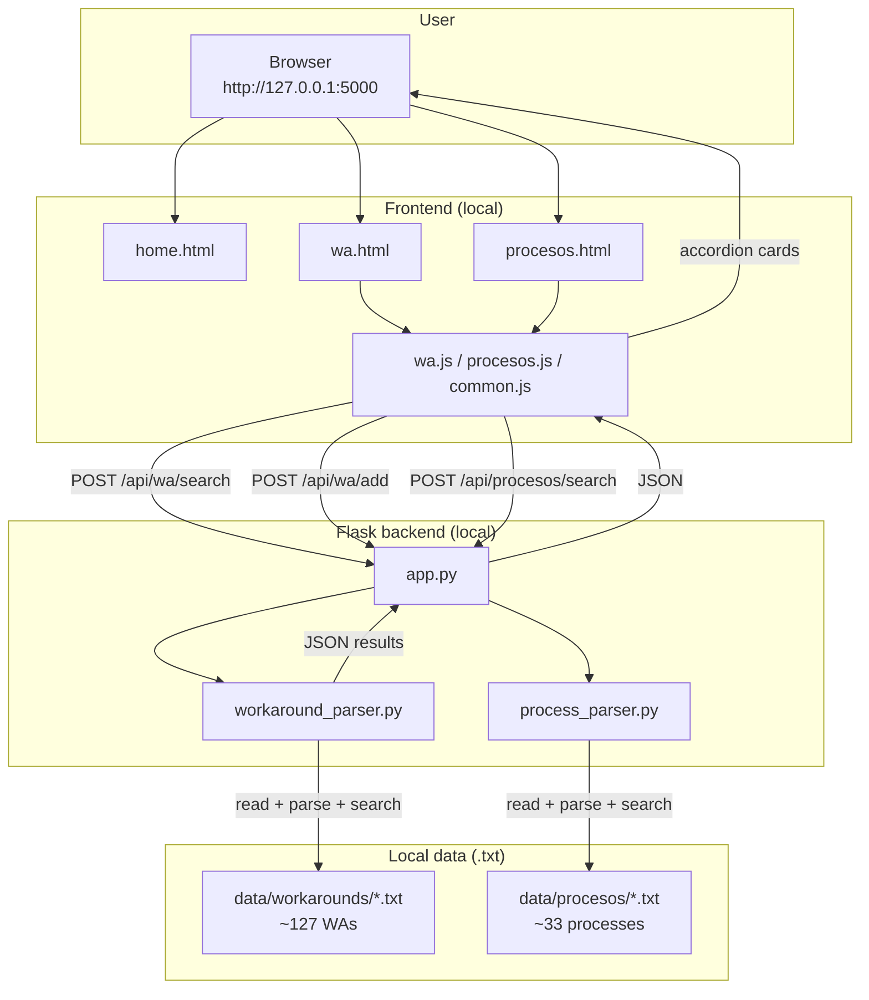
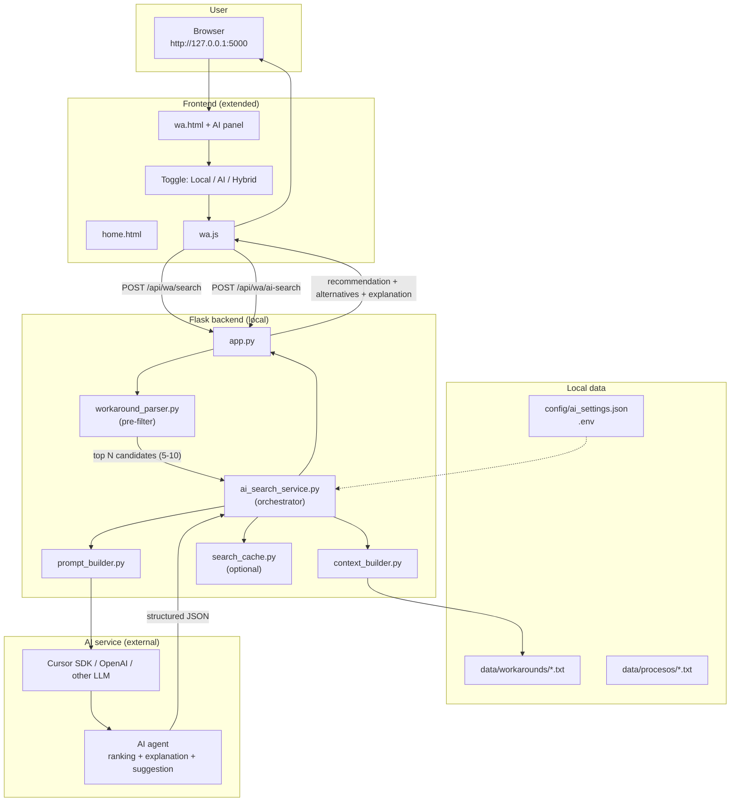

# CSM-WA — Hybrid AI Architecture Plan

Planning document to evolve the current application (local text-based search) toward a **hybrid model**: local parser + AI for ranking, explanation, and suggestions.

**Version:** 1.0  
**Date:** July 2026  
**Status:** Planning (not implemented)

---

## Table of contents

1. [Executive summary](#executive-summary)
2. [Current architecture](#current-architecture)
3. [Target architecture](#target-architecture)
4. [Comparison](#comparison)
5. [Implementation plan by phase](#implementation-plan-by-phase)
6. [Proposed API contract](#proposed-api-contract)
7. [New file structure](#new-file-structure)
8. [Effort estimate](#effort-estimate)
9. [Risks and mitigations](#risks-and-mitigations)
10. [Final recommendation](#final-recommendation)

---

## Executive summary

CSM-WA today searches workarounds in local `.txt` files using text-matching rules (`workaround_parser.py`). It works well for exact or partial matches, but does not explain why a WA is the best match, cannot combine information from multiple WAs, and does not suggest new solutions.

The proposed architecture **does not replace** the local parser. It uses it as **layer 1** (fast pre-filter) and adds **layer 2** with AI that analyzes the best candidates, picks the most relevant one, explains why, and optionally suggests improvements.

```
Layer 1 (local, fast, no cost)   →  finds candidates
Layer 2 (AI, smart, paid)          →  picks, explains, suggests
```

---

## Current architecture

### Diagram



### Current flow

1. User types an error or pastes a full Tuxedo stack trace in the search box.
2. `wa.js` sends the query to `POST /api/wa/search`.
3. Flask loads all `.txt` files from `data/workarounds/`.
4. `workaround_parser.py` parses entries and applies matching rules (keywords or Tuxedo signals).
5. Returns a list sorted by score.
6. Frontend displays results in accordion cards; user expands and reviews manually.

### Current components

| Component | Role |
|-----------|------|
| `app.py` | Flask server, web routes and REST API |
| `workaround_parser.py` | Parser, search, and WA formatting |
| `process_parser.py` | Parser, search, and process formatting |
| `templates/` | HTML UI (home, WAs, processes) |
| `static/js/` | Search, forms, accordions |
| `data/workarounds/` | `.txt` files with workarounds |
| `data/procesos/` | `.txt` files with procedures |

### Current limitations

- Does not explain **why** a WA is the best match.
- Cannot combine information from multiple WAs.
- Does not suggest new solutions when no WA fits well.
- Search is rule-based, not deep semantic reasoning.
- Very long, variable Tuxedo errors depend on extracted signals (recently improved, but still rule-based).

---

## Target architecture

### Diagram



### New flow

1. User pastes an error or Tuxedo stack trace in the search box.
2. **Phase 1 (local):** `workaround_parser.py` runs a fast pre-filter and returns the top 5–10 candidates.
3. **Phase 2 (AI):** a prompt is built with the query + candidates (not all 127 WAs).
4. AI analyzes and returns:
   - Recommended WA (or none if no reasonable match)
   - Why it fits
   - Ranked alternatives
   - Improved suggestion (if no WA fits perfectly)
5. Frontend shows the AI recommendation prominently + classic results as fallback.

### Proposed UI

```
[ Search box ]
[ Mode: ● Hybrid  ○ Local only ]

┌─ AI Recommendation ─────────────────────┐
│ Best match: RESUME                      │
│ Confidence: High                        │
│ Why: Matches csRsCanSub, SERVICE_...    │
│ [View full WA]                          │
└─────────────────────────────────────────┘

Other possible matches (local search)
  ▼ RESUME SUBSCRIBER
  ▼ CANCELATION
```

---

## Comparison

| Aspect | Current architecture | Hybrid architecture |
|--------|----------------------|---------------------|
| Search engine | `workaround_parser.py` only | Parser + AI |
| Speed | Milliseconds | Seconds (with AI) |
| Cost per search | $0 | Tokens / API |
| Internet required | No | Yes for AI mode |
| Match explanation | No | Yes ("Why this match") |
| New suggestion | No | Yes (if no perfect match) |
| Privacy | Fully local | Data sent to external service |
| Fallback | N/A | Automatic to local parser |
| Sensitive data (BAN/CTN) | Stays on machine | Requires masking |

---

## Implementation plan by phase

### Phase 0 — Definition and decisions (1–2 days)

| Task | Detail |
|------|--------|
| Choose AI provider | Cursor SDK, OpenAI, Azure OpenAI, etc. |
| Define operation mode | Hybrid only, or Local / AI / Hybrid toggle |
| Data policy | Which fields are sent to AI (mask BAN/CTN) |
| Budget | Daily query limit, estimated cost per search |
| AI response format | Fixed JSON with required fields |

**Deliverable:** decisions document + AI response JSON contract.

---

### Phase 1 — AI service layer (backend, no UI)

| Task | File(s) |
|------|---------|
| Configuration | `.env`, `config/ai_settings.json` |
| Orchestrator | `ai_search_service.py` |
| Context builder | `context_builder.py` |
| Prompt builder | `prompt_builder.py` |
| New API route | `POST /api/wa/ai-search` in `app.py` |
| Response validation | `ai_response_parser.py` |
| Logging | Log queries without sensitive data |

**Required behavior:**

- If AI does not respond → return local parser results.
- If AI returns invalid data → local fallback.
- AI must **never** invent WAs that do not exist in local files.

---

### Phase 2 — Improve local pre-filter

| Task | Detail |
|------|--------|
| Keep `workaround_parser.py` | Foundation of hybrid model |
| Tune Tuxedo scoring | Thresholds and signals |
| Unified endpoint | `/api/wa/search?mode=hybrid` |
| Limit candidates | Configurable `top_n=8` |
| Candidate metadata | Error, tags, Tuxedo excerpt, truncated workaround |

**Goal:** send only relevant context to AI (~8–15 KB), not full files.

---

### Phase 3 — Frontend changes

| Task | Detail |
|------|--------|
| Mode toggle | Local / Hybrid |
| AI recommendation panel | Highlighted card above results |
| "Why this match" section | AI-generated explanation |
| "Suggested improvement" section | Only when no perfect match |
| Loading indicator | "Analyzing with AI…" |
| Visual fallback | If AI fails, show local results without visible error |

---

### Phase 4 — Security and privacy

| Task | Detail |
|------|--------|
| Masking | BAN/CTN → `***` before sending to AI |
| Opt-in / notice | "This query will be sent to an AI service" |
| `.env` | API keys outside repository |
| Rate limiting | Max N AI searches per minute |
| Audit | Query logs without sensitive data |

---

### Phase 5 — Extend to Processes (optional)

1. `process_parser.py` → local pre-filter.
2. `ai_search_service.py` variant for processes.
3. `POST /api/procesos/ai-search`.

---

### Phase 6 — Future optimizations (v2)

| Improvement | Description |
|-------------|-------------|
| Embeddings | Vector-index WAs for better pre-filter |
| Cache | Same query + same WAs → cached response |
| Feedback | "Was this helpful?" button to tune prompts |
| Add from AI | "Save this suggestion as new WA" |
| Batch import | AI helps normalize new WAs from Clarify |

---

## Proposed API contract

### Request: `POST /api/wa/ai-search`

```json
{
  "query": "1) Failed to retrieve array from SERVICE_AGREEMENT...",
  "mode": "hybrid",
  "top_n": 8
}
```

### Response

```json
{
  "mode": "hybrid",
  "local_results": [],
  "ai": {
    "available": true,
    "recommended": {
      "error": "RESUME",
      "source_file": "csm_workarounds.txt",
      "line_number": 3589,
      "confidence": "high",
      "reason": "Matches csRsCanSub, SERVICE_AGREEMENT cancel RC, SQL-02112..."
    },
    "alternatives": [
      {
        "error": "RESUME SUBSCRIBER",
        "confidence": "medium",
        "reason": "Related resume flow with similar SERVICE_AGREEMENT errors"
      }
    ],
    "suggested_solution": null,
    "disclaimer": "AI-assisted recommendation. Verify before applying in production."
  },
  "fallback_used": false
}
```

### AI response fields

| Field | Type | Description |
|-------|------|-------------|
| `recommended` | object \| null | Most relevant WA per AI |
| `confidence` | high \| medium \| low | Confidence level |
| `reason` | string | Match explanation |
| `alternatives` | array | Other possible WAs |
| `suggested_solution` | string \| null | New solution if no perfect match |
| `fallback_used` | boolean | Whether local parser was used due to AI failure |

---

## New file structure

```
csm-wa/
├── app.py                      # routes + orchestration
├── workaround_parser.py        # pre-filter (kept)
├── workaround_parser.py.bkp    # backup
├── process_parser.py
├── ai_search_service.py        # NEW — AI calls
├── context_builder.py          # NEW — builds AI context
├── prompt_builder.py           # NEW — prompt templates
├── ai_response_parser.py       # NEW — validates AI JSON
├── search_cache.py             # NEW — optional cache
├── config/
│   └── ai_settings.json        # NEW — model, top_n, limits
├── .env.example                # NEW — API_KEY, MODEL
├── docs/
│   ├── arquitectura-ia-hibrida-ES.md
│   └── hybrid-ai-architecture-EN.md
├── templates/
│   └── wa.html                 # AI panel + mode toggle
└── static/js/
    └── wa.js                   # hybrid mode + recommendation UI
```

---

## Effort estimate

| Phase | Estimated effort | Priority |
|-------|------------------|----------|
| Phase 0 — Decisions | 1–2 days | High |
| Phase 1 — AI backend | 3–5 days | High |
| Phase 2 — Pre-filter | 1–2 days | High |
| Phase 3 — Frontend | 2–3 days | High |
| Phase 4 — Security | 1–2 days | High |
| Phase 5 — Processes | 2–3 days | Medium |
| Phase 6 — Optimizations | 1–2 weeks | Low |

**Functional hybrid MVP:** approximately 2 weeks.

---

## Risks and mitigations

| Risk | Impact | Mitigation |
|------|--------|------------|
| AI invents SQL steps | High | Strict prompt: "Only use steps from provided WAs" |
| High usage cost | Medium | Local pre-filter + cache + daily limit |
| Perceived latency | Medium | Show local results first; AI in parallel |
| Sensitive data exposed | High | Mask BAN/CTN/subscriber before sending |
| AI unavailable | Medium | Automatic fallback to local parser |
| Inconsistent responses | Medium | Strict JSON schema + validation |
| Context too large | Medium | Send only truncated top N candidates |

---

## Final recommendation

**Do not replace** `workaround_parser.py`. Use it as the pre-filter layer and add AI as the reasoning layer:

1. **Keep** local search for offline mode, speed, and zero cost.
2. **Add** hybrid mode as the smart/intelligent option.
3. **Always** fall back to the parser if AI fails.
4. **Mask** sensitive data before any external call.
5. **Validate** that AI only recommends WAs that exist in local files.

This approach keeps what already works and adds semantic analysis, explanation, and suggestions without depending exclusively on an external service.

---

## Suggested next steps

1. Approve AI provider and budget (Phase 0).
2. Define final JSON response contract.
3. Implement `ai_search_service.py` with fallback (Phase 1).
4. Test with real Tuxedo errors from the team.
5. Add recommendation UI (Phase 3).

---

*Document generated for the CSM-WA project. Does not imply code changes until approved and implemented.*
